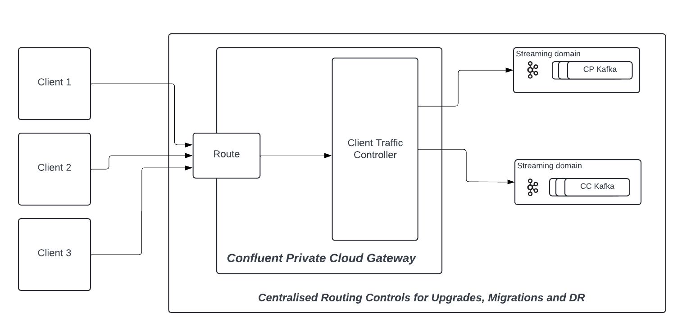

# Confluent Private Cloud Gateway

Confluent Private Cloud Gateway is a stateless, self-managed, on-premise Gateway product that is Kafka protocol aware and helps decouple your client applications from your streaming infrastructure. When deployed between clients and Kafka clusters, Gateway acts as an intelligent routing layer. As a self-managed solution, it gives you full control over deployment, configuration and operations while integrating seamlessly with your existing streaming infrastructure.

Confluent Private Cloud Gateway helps you 

- Enable future migrations of on-premise clients to Confluent Cloud without client changes.

- Enable on-premise Disaster Recovery Switch from one unhealthy cluster to another healthy cluster without client changes and hence achieve significant reduction in RTO.

- Enable Secure External Partner Access for a private cluster.

- Enable Custom domains for your Kafka listeners.

- Enable Blue-Green upgrades from an earlier Kafka version to a latest Kafka version.

## How does Confluent Private Cloud Gateway work?

Confluent Private Cloud Gateway introduces new routing constructs called ***Routes*** and ***Streaming Domains*** to create an abstraction layer between client applications and Kafka clusters. These routing abstractions help decouple the client applications and Kafka brokers.

### Route
- A Gateway endpoint where client applications connect to stream data.
Gateway endpoint where client applications connect to stream data.

### Streaming Domain 
- Logical representation of your Kafka clusters at the Gateway.

With Confluent Private Cloud Gateway, you need to configure each Route with a Streaming Domain. And, Client applications connect to Gateway's Routes instead of directly connecting to broker's listener endpoints. For every payload request addressed to a particular Route, Gateway will automatically forward the request to a Kafka cluster based on the Route's associated Streaming Domain. 

You can create multiple Routes and associate multiple Streaming Domains to the Gateway. By changing the mapping of a Route to a different Streaming Domain, Central Platform teams can independently and centrally change the backing Kafka cluster infrastructure for migrations, upgrades, disaster recovery without having to wait on the client teams for client side credential, TLS and bootstrap address changes. It is the central platform team's responsibility to ensure data replication is set between the source, destination clusters as per your tolerance to data loss and ensure the client applications have enough access in destination clusters to avoid disruptions. 

  

Please speak to your Confluent account team for more details.

