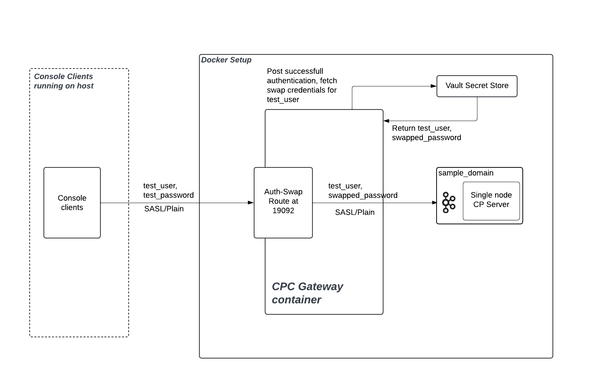

# Authentication Swapping Example

This example demonstrates how to set up **Authentication Swapping** at CPC Gateway. Authentication swapping allows the Gateway to authenticate clients with one set of credentials and then use different (swapped) credentials when forwarding requests to the Kafka broker.

Authentication Swapping at Gateway helps in scenarios where:

1. You need to migrate clients between source and destination clusters that have different authentication requirements, without modifying client applications
2. You want to share cluster access with external clients while maintaining your internal authentication standards, even when you cannot enforce those standards directly on the client side

Example outlined demonstrates swapping only the credential and not the principal of the incoming client. Not swapping the principal ensures the RBAC and audit tracking already defined in existing clusters are not impacted. However, CPC Gateway also supports swapping principal at the Gateway layer before forwarding the request to the brokers. When principal swapping is also enabled, you need to ensure appropriate RBAC policies are defined as per the new principal.

Following combinations of Authentication Swapping are supported for testing,

| Client → Gateway | Gateway → Broker |
|-----------------|------------------|
| SASL/Plain      | SASL/Plain      |
| SASL/Plain      | SASL/OAuthBearer|

Following secret stores are supported for fetching the credentials,

1. HashiCorp Vault
2. AWS Secret Manager
3. Azure Key Vault

More details on how to configure Gateway with different secret stores are available [here](https://github.com/confluentinc/gateway-images/blob/master/examples/CONFIG_GUIDE.md#5-secret-stores)

## Overview - Authentication Flow and Configuration

In this setup:
- **Clients** authenticate to the Gateway using their original credentials
- **Gateway** authenticates clients and extracts their principal
- **Gateway** fetches swapped credentials from a secret store (Vault) using the client's principal
- **Gateway** forwards authentication requests to Kafka using the swapped credentials
- **Kafka broker** authenticates using the swapped credentials


<div align="center">
  
</div>


| Step | Component | Action | Credentials/Configuration |
|------|-----------|--------|-------------------------|
| 1 | Client | Authenticates to Gateway | **Credentials:** `test_user`/`test_password`<br><br>Uses SASL PLAIN authentication |
| 2 | Gateway | Authenticates incoming client | **JAAS Config (`jaas-config-for-gw-authn.conf`):**<br>```org.apache.kafka.common.security.plain.PlainLoginModule required user_test_user="test_password";``` |
| 3 | Gateway | Fetches swapped credentials | **From Vault:** Looks up credentials for `test_user`<br>Gets `swapped_password` |
| 4 | Gateway | Forwards to Kafka broker | **JAAS Template (`jaas-template-for-gw-swapping.conf`):**<br>```org.apache.kafka.common.security.plain.PlainLoginModule required username="%s" password="%s";```<br><br>Values filled in as: `test_user`/`swapped_password` |
| 5 | Kafka Broker | Authenticates Gateway | **JAAS Config (`jaas-config-for-broker-authn.conf`):**<br>```KafkaServer { org.apache.kafka.common.security.plain.PlainLoginModule required username="admin" password="admin-secret" user_admin="admin-secret" user_test_user="swapped_password";};``` 

## Gateway Configuration

- Below is a set of configs to bring up a gateway container that acts as a proxy for the kafka-1 broker defined above.  
- kafka-1 is onboarded with the Gateway with streaming domain as sample-domain. Gateway connects to this sample streaming domain using internal-listener-endpoint as the bootstrap server endpoint.
- This Gateway exposes one route called auth-swap-route. This route endpoint is running at host.docker.internal:19092. 
- Clients stream data to Kafka-1 brokers via this route. Authentication swapping is enabled for this route.
- When authentication swapping is enabled, Gateway will authenticate the incoming client and post successful authentication, it will extract the principal of the incoming client and use it to fetch the swapped credentials from the secret store.
- Gateway forwards the request to the kafka-1 broker using the swapped credentials. Broker will perform authentication using the swapped credentials.
- For simplicity of local development, we are using port based routing, disabled encryption from client to gateway and gateway to broker.
- In a production environment, you should use TLS encryption from client to gateway and gateway to broker. And use SNI routing for routing requests to the correct broker.

``` yaml
gateway:
    image: "${GATEWAY_IMAGE}"
    container_name: gateway
    depends_on:
      - kafka-1
      - vault
    volumes:
      - ${GATEWAY_JAAS_CONF_FOR_GW_AUTHN}:/etc/gateway/config/jaas-config-for-gw-authn.conf # loading JAAS config for SASL authentication at Gateway
      - ${GATEWAY_JAAS_TEMPLATE_FOR_GW_SWAPPING}:/etc/gateway/config/jaas-template-for-gw-swapping.conf # loading JAAS template for SASL authentication at Gateway
    environment:
      GATEWAY_CONFIG: | 
        gateway:
          admin:
            endpoints:
              metrics: true
          secretStores:
            - name: vault-secret-store
              provider:
                type: Vault
                config:
                  address: http://vault:8200
                  authToken: vault-plaintext-root-token
                  path: secret/testing
                  separator: /
      
          streamingDomains:
            - name: sample-domain  
              type: kafka
              kafkaCluster:
                name: kafka-cluster-1 
                nodeIdRanges:
                  - name: d
                    start: 1 
                    end: 5
                bootstrapServers:
                  - id: internal-kafka-listener  
                    endpoint: "kafka-1:44444" 
          routes:
            - name: auth-swap-route
              endpoint: "host.docker.internal:19092" 
              brokerIdentificationStrategy:
                type: port 
              streamingDomain:
                name: sample-domain
                bootstrapServerId: internal-kafka-listener 
              security:
                auth: swap 
                swapConfig:
                  clientAuth:
                    sasl:
                      mechanism: PLAIN
                      callbackHandlerClass: org.apache.kafka.common.security.plain.internals.PlainServerCallbackHandler
                      jaasConfig:
                        file: /etc/gateway/config/jaas-config-for-gw-authn.conf
                  secretStore: vault-secret-store
                  clusterAuth:
                    sasl:
                      mechanism: PLAIN
                      callbackHandlerClass: org.apache.kafka.common.security.authenticator.SaslClientCallbackHandler
                      jaasConfig:
                        file: /etc/gateway/config/jaas-template-for-gw-swapping.conf

```

## Setup Instructions

## Environment Variables

The following environment variables are set in `start.sh`:

- `GATEWAY_IMAGE`: Confluent Platform Gateway image
- `KAFKA_SERVER_JAAS_CONF`: Path to broker JAAS configuration
- `GATEWAY_JAAS_CONF_FOR_GW_AUTHN`: Path to Gateway authentication JAAS config
- `GATEWAY_JAAS_TEMPLATE_FOR_GW_SWAPPING`: Path to Gateway swapping JAAS template

### 1. Start the Services
```bash
# Make the start script executable
chmod +x start.sh

# Start all services
./start.sh
```

### 2. Verify Services are Running
```bash
# Check container status
docker ps

# Check Vault UI (optional)
# Open http://localhost:8200 in your browser
# Login with token: vault-plaintext-root-token
```
### 3. Test Authentication Swapping

This example uses Kafka console clients for testing. 

You can download the Kafka consoleclients [here](https://kafka.apache.org/downloads) to get your console clients to work with the Gateway container. Console clients are available within the bin directory once you unzip the Kafka binary.

Create a client config file "auth_swap_client.properties" with the following details and make them accessible for the console clients. Since this is authentication swapping experience, in the client property files, we need to provide credentials expected by the Gateway wrt the client.

```
security.protocol=SASL_PLAINTEXT
sasl.mechanism=PLAIN
sasl.jaas.config=org.apache.kafka.common.security.plain.PlainLoginModule required \
username="test_user" \
password="test_password";
```

Since the Auth-Swap Route is available at Gateway's localhost:19092, we need the clients to connect to localhost:19092 to stream data. 
Following are the commands to create a topic, produce and consume to the Auth-Swap Route using the Gateway. All this traffic will be forwarded by Gateway to broker's internal Kafka listener as per the Gateway setup.

Since the Auth-Swap route is configured with Authentication Swapping, all the client authentication requests on this Route will be handled as per the Authentication Swapping experience. If you wish not to swap credentials of a particular client, you need to create a different Route with Identity Passthrough and connect the client to the Identity Passthrough Route. 

**Create a topic via the Gateway** 
```
 ./kafka-topics --bootstrap-server localhost:19092 --create --topic "test-topic" --command-config auth_swap_client.properties
```

**Run the producer**
```
while true; do                                                                                                              
  echo "Test message at $(date '+%H:%M:%S')"
  sleep 2
done | ./kafka-console-producer --bootstrap-server localhost:19092 --topic test-topic --producer.config auth_swap_client.properties
```

**Run the consumer**
``` 
./kafka-console-consumer --bootstrap-server localhost:19092 --topic test-topic --consumer.config auth_swap_client.properties
```

### Cleanup

```bash
# Stop and remove all containers
docker compose down -v

# Remove orphaned containers
docker container prune -f

# Remove volumes (optional)
docker volume prune -f
```
