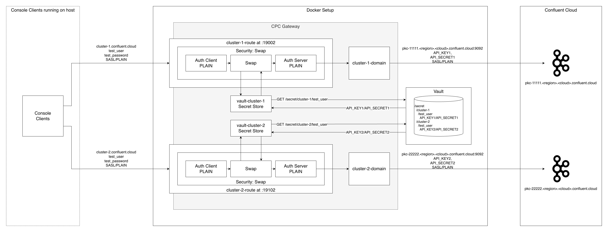

# Custom Domains And Authentication Swapping to Confluent Cloud

This example demonstrates how to configure CPC Gateway Custom Domains and Authentication Swapping to proxy traffic to Confluent Cloud clusters.

Authentication swapping enables the Gateway to authenticate incoming client connections using one set of credentials, then transparently replace (swap) them with different Confluent Cloud credentials (stored in HashiCorp Vault) when forwarding requests to the target clusters.

<div align="center">
  
</div>

## Overview

In this configuration:

The Gateway acts as a secure intermediary. It validates clients using SASL/PLAIN authentication, then swaps credentials to use Confluent Cloud API keys when forwarding requests to the corresponding cluster.

When clients connect:

1. Client connects to Gateway to `localhost:19002` or `localhost:19102` depending on the target cluster it is trying to reach using `SASL/PLAIN`
2. The Gateway locally authenticate the request using PLAIN as SASL mechanism
3. The Gateway query HashiCorp Vault to swap the client credentials
4. The Gateway forwards the authentication request to Confluent Cloud using the retrieve API credentials.
5. Confluent Cloud verifies the provided API key and secret.
6. Data flows through Gateway to/from Confluent Cloud

## Setup Instructions

### Step 1: Host Resolution for Custom Domains defined at CPC Gateway

This example uses a Gateway Route endpoint to expose two custom domains — `cluster-1.confluent.cloud` and `cluster-2.confluent.cloud` — for your Confluent Cloud clusters. To make these domains resolvable locally, add entries in your `/etc/hosts` file that map both domain names to `localhost`.

```
127.0.0.1       cluster-1.confluent.cloud
127.0.0.1       cluster-2.confluent.cloud
```

### Step 2: Download SSL Certificates from Confluent Cloud

The Gateway needs to trust the SSL certificates from your Confluent Cloud cluster. Use the provided script to download and create a truststore:

```bash
chmod +x ./download-cc-certs.sh
./download-cc-certs.sh <your-cc-bootstrap-server>
```

**Example:**

```bash
./download-cc-certs.sh pkc-xxxxx.us-west2.gcp.confluent.cloud:9092
```

This script will:

1. ✅ Download the certificate chain from your Confluent Cloud cluster
2. ✅ Create certificates in `ssl/<your-cc-domain>/` directory
3. ✅ Create a PKCS12 truststore at `ssl/<your-cc-domain>/truststore.p12`
4. ✅ Create a password file at `ssl/<your-cc-domain>/truststore.password`
5. ✅ Verify the truststore was created successfully

**Certificate Storage:**

The script creates a domain-specific directory based on your Confluent Cloud cluster:

```
ssl/
  └── pkc-xxxxx.us-west2.gcp.confluent.cloud/
      ├── truststore.p12
      └── truststore.password
```

This directory structure is mounted to `/etc/gateway/ssl/` in the Gateway container via `docker-compose.yaml`, making the certificates available at:

- `/etc/gateway/ssl/pkc-xxxxx.us-west2.gcp.confluent.cloud/truststore.p12`
- `/etc/gateway/ssl/pkc-xxxxx.us-west2.gcp.confluent.cloud/truststore.password`

The certificates are configured in the Gateway's `streamingDomains` section under `ssl.truststore`.

### Step 3: Update Gateway Configuration

Edit `gateway.yaml` and update the following item:

1. **Bootstrap server endpoint** - Replace with your Confluent Cloud clusters endpoint
2. **SSL certificate paths** - Update the paths to match the directory created by the download script

**Note:** The paths in `gateway.yaml` reference `/etc/gateway/ssl/<your-cluster-(1 or 2)-domain>/` because the `docker-compose.yaml` mounts `./ssl` to `/etc/gateway/ssl` in the container.

### Step 4: Obtain Confluent Cloud API Key and Secret

Confluent Cloud API credentials are scoped per resource, as such you will need one pair of API Key/Secret per cluster.
Assuming you have the right permission, you can use the following CLI command to create an API key.

```
confluent api-key create --resource lkc-11111 --description 'API Key for client foo for cluster-1'
```

You can also use the Confluent Cloud Console.

1. Log in to [Confluent Cloud Console](https://confluent.cloud)
2. Navigate to your cluster
3. Go to "API Keys" section
4. Create a new API key for each one of your cluster or use an existing one

### Step 5: Update Docker Compose Configuration

Edit `docker-compose.yaml` and replace the `<your-API-Key-x>/<your-API-Secret-x>` with the values from the API Keys you created in the previous step.

### Step 6: Start the Gateway

Make the startup script executable and run it:

```bash
chmod +x ./start.sh
./start.sh
```

This will start the Gateway container with the appropriate configuration.

## Testing the Connection

Once the Gateway is running, you can test it using Kafka command-line tools:

### List Topics

```bash
kafka-topics --bootstrap-server cluster-1.confluent.cloud:19002 --list --command-config client.properties
```

```bash
kafka-topics --bootstrap-server cluster-2.confluent.cloud:19102 --list --command-config client.properties
```

### Create a Topic

```bash
kafka-topics --bootstrap-server cluster-1.confluent.cloud:19002 --create --topic cluster-1-topic --command-config client.properties
```

```bash
kafka-topics --bootstrap-server cluster-2.confluent.cloud:19002 --create --topic cluster-2-topic --command-config client.properties
```

### Produce Messages

```bash
kafka-console-producer --bootstrap-server cluster-1.confluent.cloud:19002 --topic cluster-1-topic --producer.config client.properties
```

```bash
kafka-console-producer --bootstrap-server cluster-2.confluent.cloud:19002 --topic cluster-2-topic --producer.config client.properties
```

### Consume Messages

```bash
kafka-console-consumer --bootstrap-server cluster-1.confluent.cloud:19002 --topic cluster-1-topic --from-beginning --consumer.config client.properties
```

```bash
kafka-console-consumer --bootstrap-server cluster-2.confluent.cloud:19002 --topic cluster-2-topic --from-beginning --consumer.config client.properties
```

## Stopping the Gateway

```bash
docker compose down -v
```
